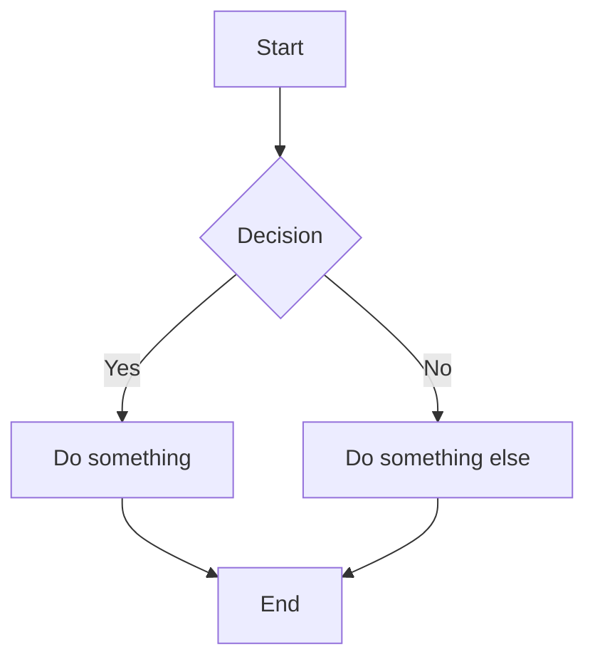

# Welcome to ULDE Docs

This is your first page rendered through Ulde.

# Mermaid Test

Library	| Pros	| Notes  |
|:------- | ----- | ------ |
| marked	|Fast, simple	|Great default |
| markdown-it	|Plugin ecosystem	|Best extensibility |
| remark/unified	|Most powerful	|Heavier, async |

| First Header  | Second Header |
| ------------- | ------------- |
| Content Cell  | Content Cell  |
| Content Cell  | Content Cell  |

| Command | Description |
| --- | --- |
| `git status` | List all *new or modified* files |
| `git diff` | Show file differences that **haven't been** staged |
